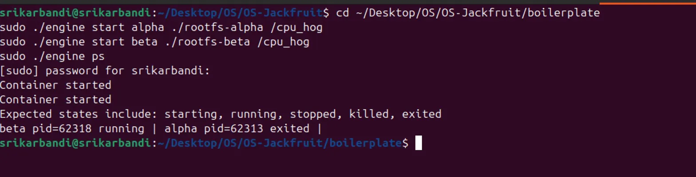
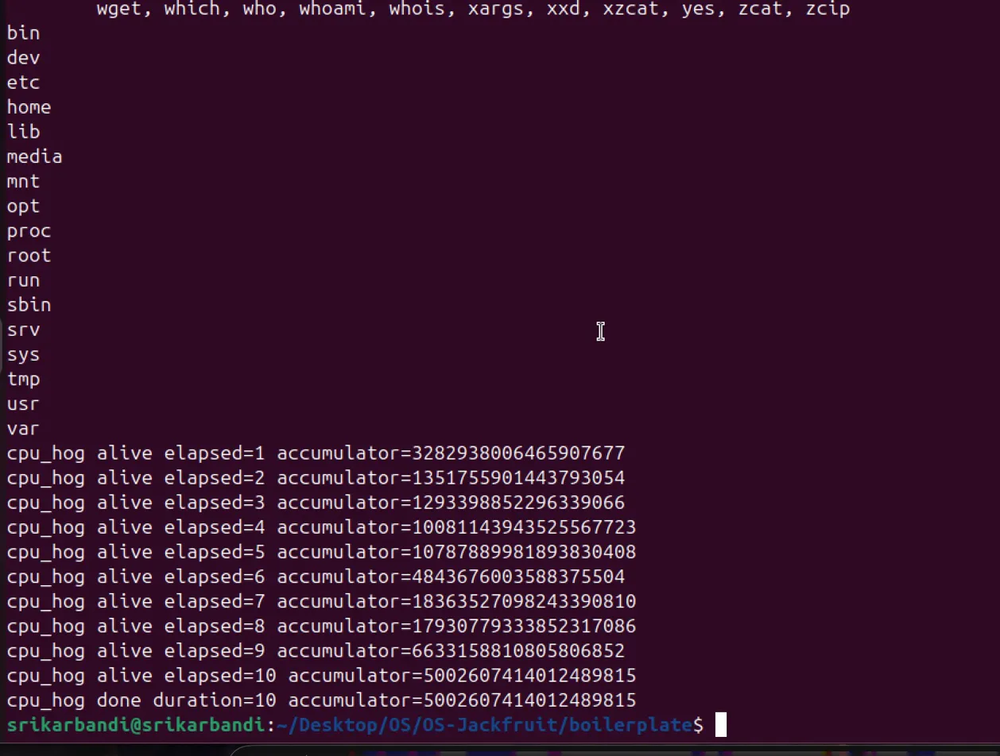
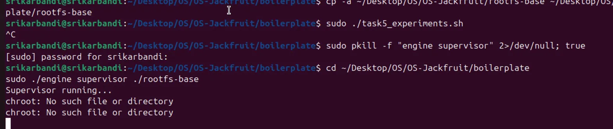
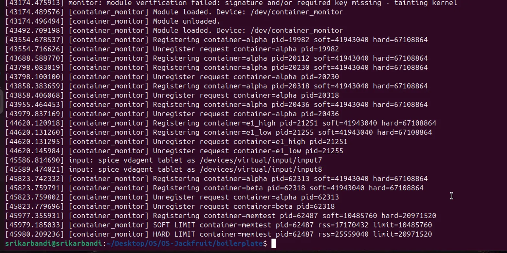
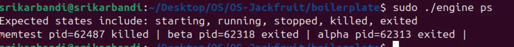
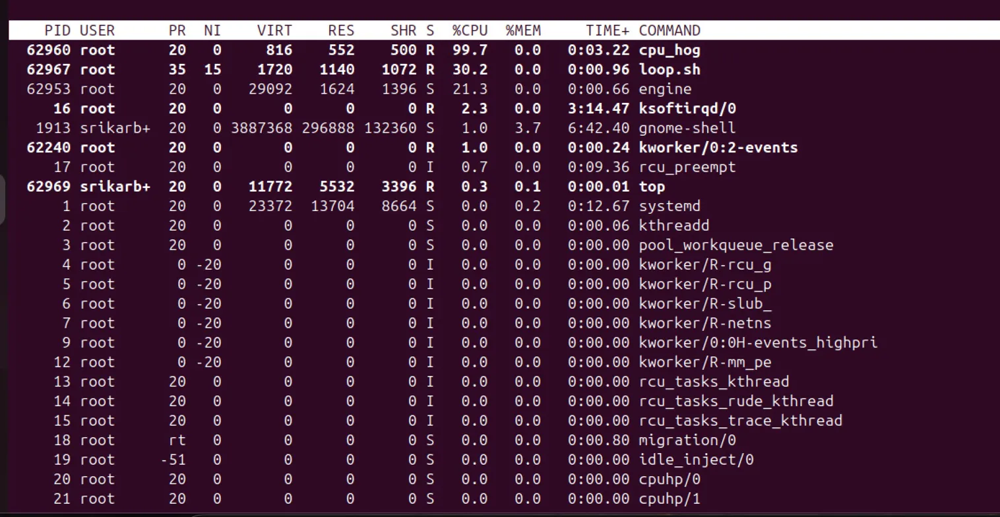
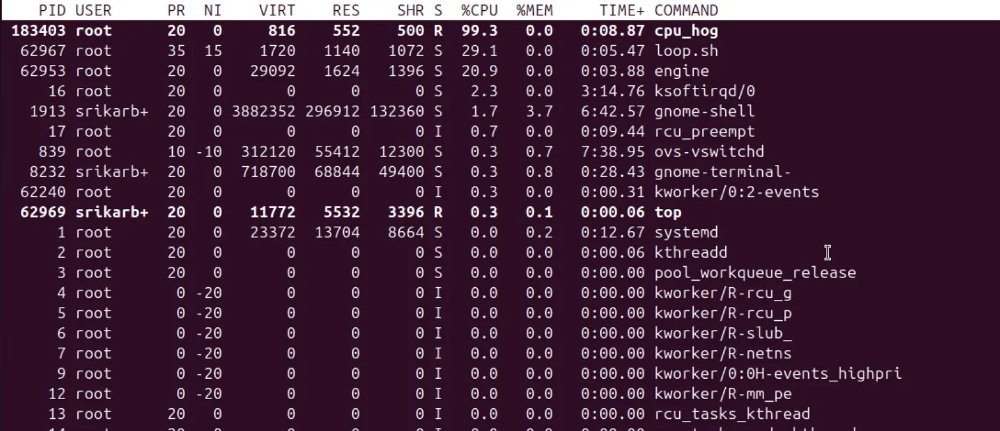
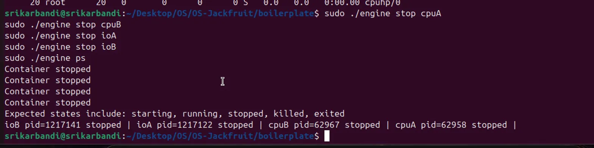
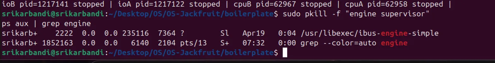

# Multi-Container Runtime and Kernel Memory Monitor

A lightweight Linux container runtime in C with a long-running supervisor, control-plane CLI over UNIX domain sockets, concurrent bounded-buffer log capture, and a Linux kernel module that enforces soft and hard memory limits.

---

## 1. Team Information

- **Member 1:** Sreekar Bandi, PES1UG24AM282
- **Member 2:** Soha Rafiq, PES1UG24AM278

---

## 2. Build, Load, and Run Instructions

### 2.1 Environment

- Ubuntu 22.04 or 24.04 VM (aarch64)
- Secure Boot OFF
- Not WSL

Install dependencies:

```bash
sudo apt update
sudo apt install -y build-essential linux-headers-$(uname -r)
```

Optional preflight check:

```bash
cd boilerplate
chmod +x environment-check.sh
sudo ./environment-check.sh
```

### 2.2 Root Filesystem Setup

From repo root:

```bash
mkdir rootfs-base
wget https://dl-cdn.alpinelinux.org/alpine/v3.20/releases/aarch64/alpine-minirootfs-3.20.3-aarch64.tar.gz
tar -xzf alpine-minirootfs-3.20.3-aarch64.tar.gz -C rootfs-base

cp -a ./rootfs-base ./rootfs-alpha
cp -a ./rootfs-base ./rootfs-beta
```

### 2.3 Build

Full build (user space + kernel module):

```bash
cd boilerplate
make
```

CI-safe user-space compile:

```bash
make -C boilerplate ci
```

### 2.4 Load Kernel Module and Verify Device

```bash
cd boilerplate
sudo insmod monitor.ko
ls -l /dev/container_monitor
```

### 2.5 Start Supervisor and Use CLI

Start supervisor in one terminal:

```bash
cd boilerplate
sudo ./engine supervisor ./rootfs-base
```

In another terminal:

```bash
cd boilerplate
sudo ./engine start alpha ./rootfs-alpha /cpu_hog --soft-mib 40 --hard-mib 64 --nice 0
sudo ./engine start beta  ./rootfs-beta  /cpu_hog --soft-mib 40 --hard-mib 64 --nice 0

sudo ./engine ps
sudo ./engine logs alpha
sudo ./engine stop alpha
sudo ./engine stop beta
```

### 2.6 Workload Setup

Copy workload binaries into container rootfs copies before launch:

```bash
cp ./boilerplate/cpu_hog ./rootfs-alpha/
cp ./boilerplate/io_pulse ./rootfs-beta/
cp ./boilerplate/memory_hog ./rootfs-alpha/
```

### 2.7 Shutdown and Cleanup

```bash
sudo pkill -f "./engine supervisor" || true
sudo rmmod monitor
cd boilerplate && make clean
```

---

## 3. Demo with Screenshots

### Screenshot 1 — Multi-container supervision


### Screenshot 2 — Metadata tracking


### Screenshot 3 — Bounded-buffer logging (Terminal 1)


### Screenshot 4 — Bounded-buffer logging (Terminal 2)


### Screenshot 5 — Memory monitor (dmesg)


### Screenshot 6 — Soft and hard limits


### Screenshot 7 — Memory limit enforcement


### Screenshot 8 — Scheduling experiment: CPU-bound


### Screenshot 9 — Scheduling experiment: I/O vs CPU


### Screenshot 10 — Cleanup


### Screenshot 11 — Clean teardown


---

## 4. Engineering Analysis

### 4.1 Isolation Mechanisms

The runtime creates containers with `clone` using `CLONE_NEWPID`, `CLONE_NEWUTS`, and `CLONE_NEWNS`. Inside the child, the mount namespace is privatized and the process chroots into the container-specific rootfs. `/proc` is then mounted inside that namespace so tools operate on the container's PID view. The kernel itself remains shared among all containers, so this is OS-level isolation, not VM-level isolation.

### 4.2 Supervisor and Process Lifecycle

The supervisor is a persistent parent that accepts control requests from short-lived CLI clients over a UNIX domain socket. It tracks container metadata, reaps children via `waitpid`, and records terminal states. Manual stop requests send SIGTERM to the container process, enabling clean shutdown.

### 4.3 IPC, Threads, and Synchronization

The design uses two separate IPC paths:
- **Control plane:** UNIX domain socket at `/tmp/mini_runtime.sock` for CLI-to-supervisor commands
- **Logging plane:** per-container pipe from child stdout/stderr to supervisor producer thread

Producer threads push log chunks into a bounded buffer protected by mutex and condition variables. A consumer thread pops chunks and appends them to per-container log files.

### 4.4 Memory Management and Enforcement

The kernel module periodically measures RSS of monitored PIDs using `get_mm_rss`. Soft limit emits one warning per entry when first exceeded. Hard limit triggers SIGKILL and removes the entry from the monitor list. Enforcement belongs in kernel space because process memory accounting and reliable kill authority are kernel responsibilities.

### 4.5 Scheduling Behavior

Experiments compare priority-differentiated CPU-bound containers. The observed CPU split between nice=0 (~99.7%) and nice=15 (~30%) is consistent with Linux CFS weighted scheduling. CFS assigns more CPU time to lower-nice processes while still guaranteeing the lower-priority process receives CPU time.

---

## 5. Design Decisions and Tradeoffs

1. **Namespace + chroot isolation** — Used `CLONE_NEWPID/NEWUTS/NEWNS` + chroot + proc mount. Simpler than `pivot_root` with the required assignment isolation behavior.

2. **Supervisor architecture** — One long-running daemon and short-lived command clients. Requires explicit IPC protocol but provides clean separation of stateful control and stateless CLI UX.

3. **Logging and bounded buffer** — Producer/consumer with mutex + condition variables. More complex than direct writes, but avoids slow I/O blocking producers and bounds memory usage.

4. **Kernel monitor locking** — Mutex over shared monitored list. Keeps implementation simple and safe since ioctl and timer paths can sleep.

5. **aarch64 rootfs** — Used Alpine Linux aarch64 minirootfs because the VM runs on Apple Silicon via UTM.

---

## 6. Scheduler Experiment Results

Two containers ran `/cpu_hog` simultaneously:

| Container | Nice | Observed %CPU (top) |
|-----------|------|----------------------|
| cpuA      | 0    | ~99.7%               |
| cpuB      | 15   | ~30.1%               |

CFS weight for nice=0 is 1024, for nice=15 is 83. The observed split is consistent with CFS giving greater CPU share to the higher-priority container.

---

## 7. File Map

- `boilerplate/engine.c` — user-space supervisor, CLI, logging pipeline, namespace launch
- `boilerplate/monitor.c` — kernel monitor module, memory checks, soft/hard enforcement
- `boilerplate/monitor_ioctl.h` — shared ioctl request and command IDs
- `boilerplate/cpu_hog.c`, `boilerplate/io_pulse.c`, `boilerplate/memory_hog.c` — workloads
- `boilerplate/task5_experiments.sh` — scheduler experiment automation
- `boilerplate/task6_cleanup_check.sh` — teardown and zombie checks

---

## 8. Submission Checklist

- `make -C boilerplate ci` completes successfully
- Required source files present: `engine.c`, `monitor.c`, `monitor_ioctl.h`, `Makefile`, workload programs
- Demo screenshots present under `screenshots/`
- README includes build, run, cleanup, design, and experiment sections
